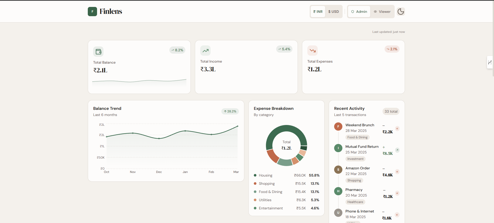
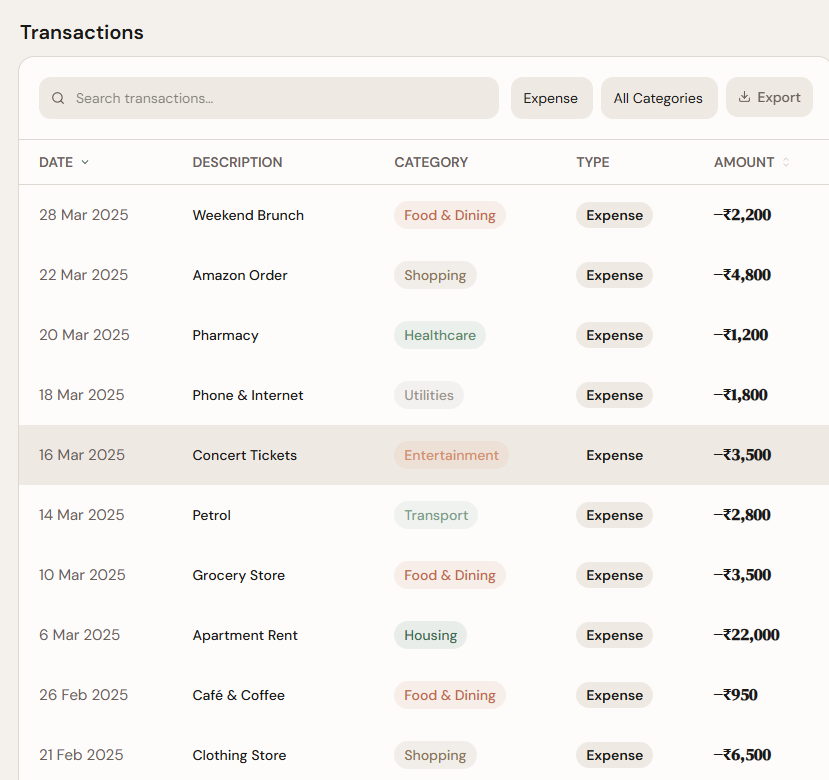
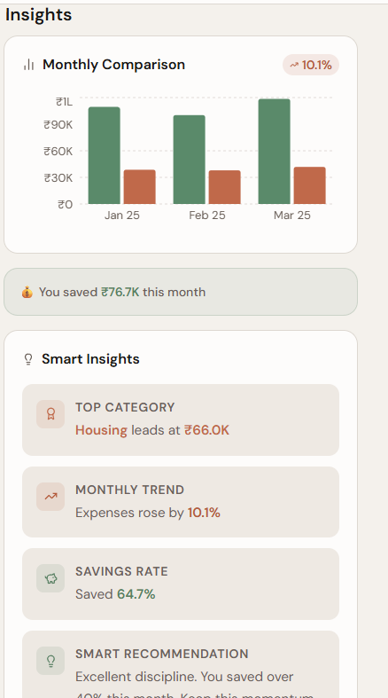
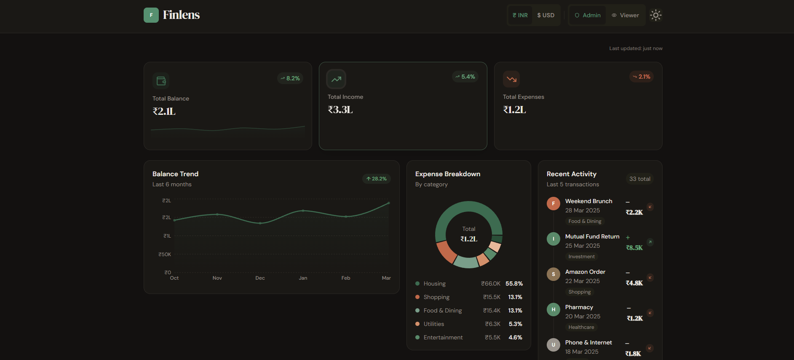

# Finlens - Personal Finance Dashboard

 Live Demo: https://vercel.com/harsh-kumar-pandeys-projects-06049d59 
 GitHub: https://github.com/Harshkumarpandey111/finance-dashboard

## Overview
Finlens is a personal finance dashboard built to track day-to-day money flow in one place.
It gives a quick view of balance, income, expenses, and spending trends so decisions are easier.
The goal of this project is simple: make personal finance data clean, visual, and useful.

## Features
- Summary cards for total balance, income, and expenses
- Balance trend chart for monthly comparison
- Expense breakdown using a donut chart
- Transactions table with search, sorting, and filters
- Insights panel with smart recommendations based on spending and saving pattern
- Currency switcher for INR and USD
- Dark mode toggle
- Role-based UI for Admin and Viewer

## Tech Stack
- React
- Tailwind CSS
- Vite
- Zustand (state management)
- Recharts (data visualization)

## Screenshots
- ### Dashboard Overview

### Transactions and Filters

### Insights Panel

### Dark Mode View

##Open README in VS Code preview
Shortcut:- Ctrl + Shift + V
( You should see images)

## How to Run the Project
1. Clone the repository

	git clone <https://github.com/Harshkumarpandey111/finance-dashboard>
	cd finance-dashboard

2. Install dependencies

	npm install

3. Start development server

	npm run dev

4. Build for production

	npm run build

5. Preview production build

	npm run preview

## Folder Structure
This project follows a simple component-based structure:

- src/components: Reusable UI pieces like cards, charts, table, modal, and insights
- src/pages: Main page layout (Dashboard)
- src/store: Global app state and actions
- src/utils: Helper functions for formatting and data calculations
- src/data: Static/mock transaction data
- src/constants: Theme and shared constants
- public: Static assets

## Key Highlights
- Smart insights are generated from actual transaction trends, not hardcoded text
- Currency switch updates values across charts, cards, and table
- Admin and Viewer roles make the UI behavior realistic for real apps
- Clean, responsive layout that works well on desktop and mobile
- Theme-first styling keeps design consistent in light and dark modes

## Future Improvements
- Add authentication and user-specific data
- Add monthly budget goals with progress tracking
- Add recurring transactions and reminders
- Add export options for PDF reports
- Connect with a backend for persistent cloud storage

## Conclusion
Finlens is a practical frontend project focused on real financial use cases.
It combines clean UI, useful data visuals, and thoughtful UX features in a lightweight React setup.
This project can be extended into a full personal finance product with backend integration.
